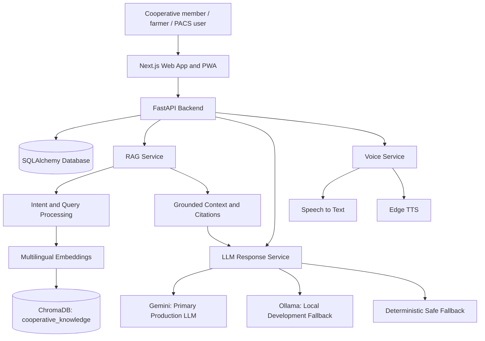

# Cooperative Mitra | सहकारी मित्र

> **Together for Stronger Communities · सहकार से समृद्धि**

Cooperative Mitra is a multilingual, source-grounded digital companion for cooperative members, farmers, PACS users, and rural communities. It makes trustworthy information about cooperative governance, legal guidance, public schemes, grievances, and financial literacy easier to discover, understand, and act on.

Built for **Smart India Hackathon**, the platform combines a simple mobile-first PWA experience with a responsible AI pipeline: retrieve verified context first, answer in the user's language, cite the source when available, and safely say when an answer cannot be verified.

> **Important:** Cooperative Mitra is an informational platform, not an official government service. Legal, financial, eligibility, and scheme information should be verified with the relevant government department, cooperative authority, PACS office, or official source before important decisions are made.

## The problem

Cooperative members often need help navigating scattered government information, complex legal language, scheme eligibility, and grievance processes. The gap is made harder by language barriers, limited digital confidence, and the risk of receiving unverified advice.

## Our solution

Cooperative Mitra brings these journeys into one multilingual experience:

- Ask questions in English, Hindi, Kannada, Marathi, or Telugu.
- Retrieve relevant knowledge from a ChromaDB-backed cooperative knowledge base.
- Generate concise, source-grounded answers with citations where available.
- Explore schemes, check eligibility, and understand legal provisions in simpler language.
- Submit and track grievances through a structured workflow.
- Use speech input and text-to-speech responses for improved accessibility.
- Access the experience as a responsive web app or installable PWA.

## Why it is trustworthy

| Design principle | How Cooperative Mitra applies it |
| --- | --- |
| Grounded answers | The assistant retrieves relevant Chroma knowledge before generating a response. |
| Source awareness | Citations and source metadata are returned where available. Official and placeholder sources remain explicitly distinct. |
| Safe failure | If context is insufficient or an LLM is unavailable, the system returns a deterministic verification-safe response instead of inventing facts. |
| Multilingual access | The same assistance is available in five Indian languages. |
| Human verification | The product clearly directs users to relevant authorities for consequential decisions. |

## Key capabilities

### Multilingual AI assistant

- English, Hindi, Kannada, Marathi, and Telugu
- Retrieval-augmented, context-aware responses
- Source citations where available
- Intent-aware handling for schemes, legal questions, grievances, and financial literacy
- Safe response when information cannot be verified

### Schemes and legal guidance

- Government scheme discovery and detailed scheme information
- Eligibility checks for supported scheme criteria
- Cooperative Acts and bye-law guidance
- Legal acts, sections, and searchable simplified explanations
- Protection against fabricated benefits, deadlines, eligibility rules, or legal provisions

### Grievance support

- Grievance submission and ticket generation
- Public ticket tracking
- Authenticated grievance management and status updates

### Accessibility and platform experience

- Speech-to-text input and Edge TTS responses
- Responsive mobile interface with safe-area-aware navigation
- Installable PWA
- Shared language selector, profiles, dashboard, and chat history

## Architecture



## RAG and LLM pipeline

1. The application identifies the user’s language and likely intent.
2. The query is embedded using `paraphrase-multilingual-MiniLM-L12-v2`.
3. ChromaDB retrieves relevant records from the `cooperative_knowledge` collection.
4. Retrieval is reranked and filtered for relevance; source metadata and citations are preserved.
5. Gemini produces the primary grounded answer in production.
6. Ollama remains a local-development fallback only. If a provider or reliable context is unavailable, a deterministic safe fallback is returned.

The knowledge base is built from the tracked source records using `nlp-rag/ingestion.py`. In Docker deployments, ingestion happens at image build time; application startup only loads the already-populated collection.

## Technology stack

| Layer | Technologies |
| --- | --- |
| Frontend | Next.js, TypeScript, PWA |
| Backend | FastAPI, Python, SQLAlchemy |
| AI and retrieval | Gemini, Sentence Transformers, ChromaDB |
| Embeddings | `paraphrase-multilingual-MiniLM-L12-v2` |
| Voice | Edge TTS, Whisper-compatible speech-to-text flow |
| Security | JWT authentication, password hashing, configured CORS |
| Deployment | Docker, Railway backend, Vercel frontend |

## Repository structure

```text
.
├── backend/
│   ├── app/                 # FastAPI routes, models, services, schemas
│   ├── alembic/             # database migrations
│   ├── tests/               # backend tests
│   └── Dockerfile           # production image; builds the RAG collection
├── frontend/
│   └── src/                 # Next.js routes, components, contexts, API client
├── nlp-rag/
│   ├── ingestion.py         # real knowledge-base ingestion pipeline
│   └── knowledge_base/
│       └── raw/             # versioned source records
├── docs/
├── docker-compose.yml
├── .env.example
└── README.md
```

## Local setup

Create a local `.env` from `.env.example`, populate the required values locally, and never commit it.

```powershell
cd <project-root>
python -m uvicorn backend.app.main:app --reload --host 0.0.0.0 --port 8000
```

```powershell
cd <project-root>/frontend
npm install
npm run dev
```

- Frontend: `http://localhost:3000`
- Backend: `http://localhost:8000`
- Health check: `http://localhost:8000/health`
- API documentation: `http://localhost:8000/docs`

## Production configuration

- Set Vercel `NEXT_PUBLIC_API_BASE_URL` to `https://cooperative-mitra-production.up.railway.app/api/v1`.
- The backend permits the official Vercel production origin and retains localhost development origins.
- Configure a strong production `SECRET_KEY`, database URL, and Gemini API key through deployment environment variables.
- Docker builds the existing Chroma collection before the backend starts and fails if the collection is empty.
- Public scheme and legal reference data are idempotently seeded at backend startup; user accounts are never seeded.

## API overview

All endpoints below are under `/api/v1`, except the root `/health` alias.

| Method | Endpoint | Purpose | Auth |
| --- | --- | --- | --- |
| GET | `/health` | Service health | No |
| POST | `/auth/register`, `/auth/login` | Registration and sign-in | No |
| GET / PUT | `/auth/me` | Signed-in profile | Yes |
| POST | `/chat` | Grounded multilingual conversation | Optional |
| GET | `/chat/sessions`, `/chat/sessions/{session_uuid}` | Conversation history | Yes |
| GET / POST | `/schemes`, `/schemes/check-eligibility` | Scheme discovery and eligibility | No |
| GET | `/legal/acts`, `/legal/sections/search` | Legal registry and search | No |
| POST / GET | `/grievances`, `/grievances/track/{ticket_number}` | Submit and track grievances | Mixed |
| POST | `/voice/tts`, `/voice/stt` | Text-to-speech and speech input | No |

## Testing

```powershell
cd <project-root>
python -m pytest backend/tests -q

cd frontend
npm run build
```

## Responsible-use commitment

- Do not commit secrets, local databases, generated audio, model caches, or generated vector stores.
- Preserve citations and source labels whenever information is returned.
- Do not fabricate legal provisions, scheme benefits, eligibility, deadlines, or financial advice.
- Treat the platform as guidance that complements—not replaces—official channels and qualified human support.

---

**Cooperative Mitra — making cooperative information more accessible, multilingual, and accountable.**