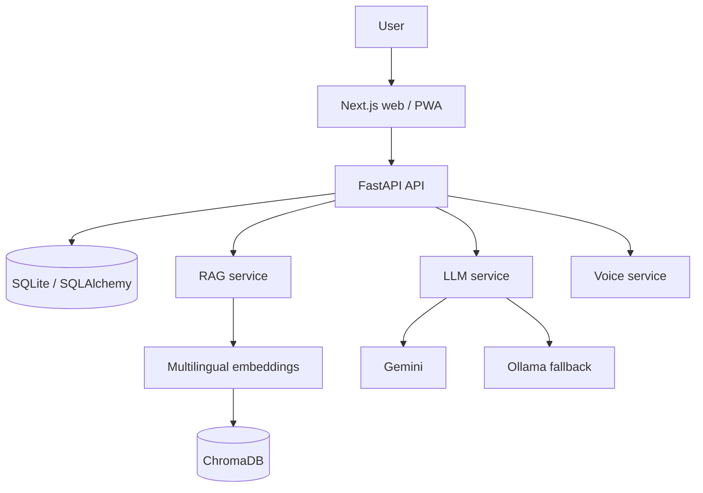

# Cooperative Mitra
### सहकारी मित्र

Cooperative Mitra is a multilingual web and installable PWA that helps cooperative members, farmers, and rural communities find source-grounded information about cooperative governance, legal and bye-law guidance, public schemes, grievances, and financial literacy. It is an informational platform, not an official government service; important decisions should be confirmed with the relevant authority.

## Features

- Five-language assistant: English, Hindi, Kannada, Marathi, and Telugu.
- Retrieval-grounded answers with source citations and an explicit unverified-information response when context is insufficient.
- Cooperative legal and bye-law registry, scheme discovery, eligibility checks, financial-literacy guidance, and grievance support.
- Optional text-to-speech responses and speech-to-text input.
- Authentication, member profile, dashboard, and chat-session history.
- Responsive web/mobile UI, PWA manifest, mobile navigation, safe-area-aware chat access, and a shared language selector.

## Architecture



## RAG and LLM behavior

The RAG pipeline handles the user language, classifies the request, creates a multilingual embedding with `paraphrase-multilingual-MiniLM-L12-v2`, retrieves matching Chroma records, filters insufficiently related results, and sends grounded context to the LLM service. Answers return their sources when available. Raw knowledge records keep source metadata so placeholder content is not presented as official.

Generation tries Gemini first, then local Ollama. If no usable grounded context or provider response is available, the service returns a safe deterministic verification message instead of inventing legal provisions, eligibility, benefits, amounts, dates, or procedures.

## Repository structure

```text
.
├── backend/
│   ├── app/                 # FastAPI routes, models, services, schemas
│   ├── alembic/             # database migrations
│   └── tests/
├── frontend/
│   └── src/                 # Next.js routes, components, contexts, API client
├── nlp-rag/
│   ├── ingestion.py
│   └── knowledge_base/      # raw sources, processed chunks, local Chroma data
├── docs/                    # deployment and source materials
├── docker-compose.yml
├── .env.example
└── README.md
```

## Setup

Create a local `.env` from `.env.example`, populate required credentials locally, and never commit it.

```powershell
cd <project-root>
python -m uvicorn backend.app.main:app --reload --host 0.0.0.0 --port 8000
```

```powershell
cd <project-root>/frontend
npm install
npm run dev
```

- Frontend: `http://localhost:3000`
- Backend: `http://localhost:8000`
- Health: `http://localhost:8000/health`
- API docs: `http://localhost:8000/docs`

## Environment variables

`.env.example` documents `ENVIRONMENT`, `APP_NAME`, `DEBUG`, `PORT`, `HOST`, `SECRET_KEY`, `ALGORITHM`, `ACCESS_TOKEN_EXPIRE_MINUTES`, `DATABASE_URL`, `GEMINI_API_KEY`, `GEMINI_MODEL`, `OLLAMA_BASE_URL`, `OLLAMA_MODEL`, `EMBEDDING_MODEL`, `CHROMA_PERSIST_DIRECTORY`, `CHROMA_COLLECTION_NAME`, `WHISPER_MODEL`, `ENABLE_EDGE_TTS`, and `NEXT_PUBLIC_API_BASE_URL`. It intentionally contains names only; populate all required values locally and use an independently generated production secret.

## Database and knowledge base

SQLite is accessed through SQLAlchemy, with Alembic migration scaffolding. The current entities are users, schemes, legal acts, legal sections, grievances, chat sessions, and chat messages.

Knowledge records are loaded from `nlp-rag/knowledge_base/raw/official` and `raw/placeholder`; ingestion chunks text (default 500 characters with 100-character overlap), embeds it, and persists it to Chroma with source metadata. Official and placeholder sources remain distinct. Re-run ingestion only when source content is deliberately updated.

## API reference

All API routes below are prefixed with `/api/v1` except the root `/health` alias.

| Method | Endpoint | Purpose | Auth |
| --- | --- | --- | --- |
| GET | `/health` | Service and dependency health | No |
| POST | `/auth/register`, `/auth/login` | Account registration and sign-in | No |
| GET/PUT | `/auth/me` | Read or update the signed-in profile | Yes |
| POST | `/chat` | Grounded assistant response | Optional |
| GET | `/chat/sessions`, `/chat/sessions/{session_uuid}` | Chat history | Yes |
| GET/POST | `/schemes`, `/schemes/check-eligibility` | Schemes and eligibility | No |
| GET | `/schemes/{scheme_id_or_code}` | Scheme detail | No |
| GET | `/legal/acts`, `/legal/acts/{act_id_or_code}`, `/legal/sections/search` | Legal registry and search | No |
| POST/GET | `/grievances`, `/grievances/track/{ticket_number}` | Submit, list, or track grievances | Mixed |
| GET/PATCH | `/grievances/{grievance_id}`, `/grievances/{grievance_id}/status` | Grievance detail or status | Yes |
| POST | `/voice/tts`, `/voice/stt` | Speech synthesis and transcription | No |
| GET | `/voice/audio/{filename}` | Voice audio asset | No |

## Frontend routes

`/`, `/chat`, `/schemes`, `/legal`, `/financial-literacy`, `/grievance`, `/dashboard`, `/profile`, `/login`, and `/register` are implemented. The PWA manifest uses `frontend/src/app/icon.svg`; the mobile navigation and floating chat entry account for the bottom safe area.

## Testing and deployment

```powershell
cd <project-root>/frontend
npm run build

cd <project-root>
pytest
```

`docker-compose.yml` defines backend and frontend services with persistent backend and Chroma volumes. A cloud deployment is not verified by this repository alone.

## Security and development rules

- Password hashing, JWT-based protected endpoints, request schemas, configured CORS, and structured logging are implemented by the backend.
- Never commit `.env`, API keys, database copies, generated audio, Chroma indexes, caches, or dependency folders.
- Preserve source citations and do not fabricate government, legal, scheme, or financial information.
- Keep frontend API contracts synchronized with backend routes and update this README when architecture changes.


## Repository Hygiene

Local environment files, secrets, runtime databases, logs, generated vector
stores, model/runtime artifacts, caches, temporary audio, and internal
development documents are excluded from the repository. Configure local
services from `.env.example`; do not commit a populated `.env` file.
